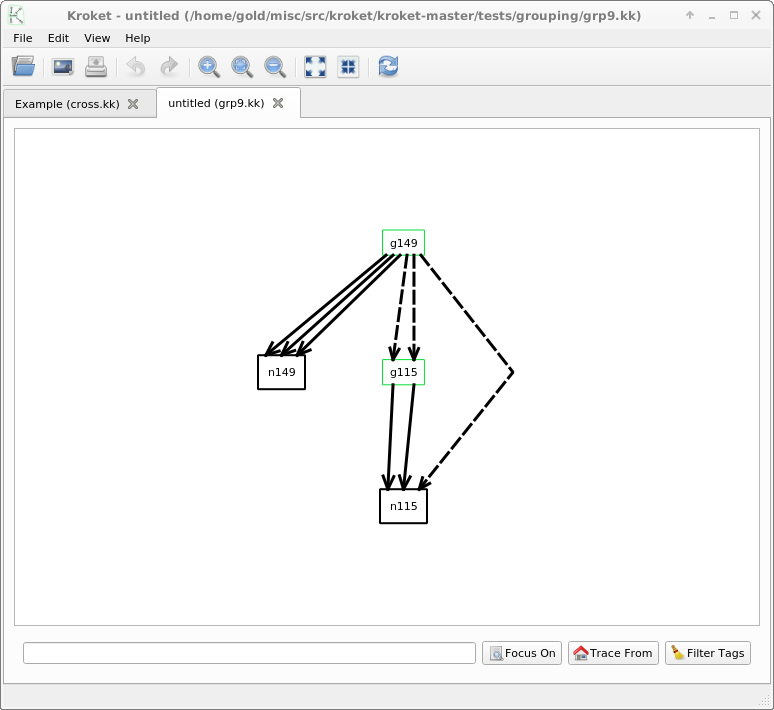

# kroketgraph
graphical graph visualization viewer with qt gui and subgraph folding feature

This is GNU GPL Free C++ graph viewer with graphicl user interface updated for qt lib version 5.  

 Kroket is an interactive directed graph visualization tool.  
 It allows you to progressively unfold the graph and to expand/collapse  
 groups of nodes.  
  
 Kroket is a free software, it is licensed under the GNU GPL.  
 Have a look at the `COPYING' file for details.  
  
 In order to run Kroket, you need the Qt library, as well as its development  
 packages if you compile it by yourself.  
  
To compile:  
qmake  
make  
  
The original version is in directory original for the older qt lib versions.  
  
The program uses own custom graph format which looks like this in the tests directory:  
<info />  
<node id="z" text="Z" />  
<node id="x" text="X" />  
<node id="y" text="Y" />  
<edge src_port="x" dest_port="y" />  
<edge src_port="y" dest_port="z" />  
<edge src_port="z" dest_port="x" />  
  
For other graph formats the parser in directory src/parser need to be updated  
This tool can have multiple graphs in the gui using tabs at same time to easy switch between graphs  
This tool has scc algorithm and sugiyama automatic graph layout algorithm  
This tool has folding of subgraphs to easy navigate large graphs with groups of nodes  
This tool has a genetic node placing algorithm  
This tool has a cuckoo node placing algorithm  
This tool has a floyd layering algorithm  
This tool has several graph manipulation features in the gui when clicking on the nodes  
In the doc directory is a manual included  
In the tests directory are example graph data to start with  
In the ui directory are the files to edit to change the user interface  
  
This are a few screenshots  
  

